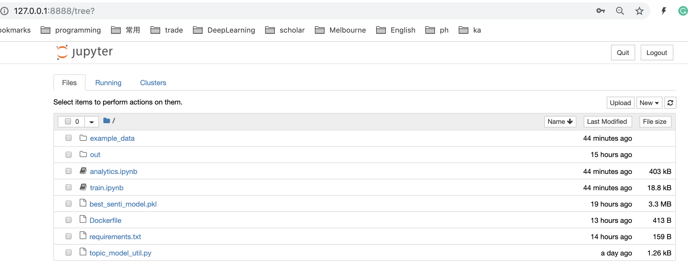
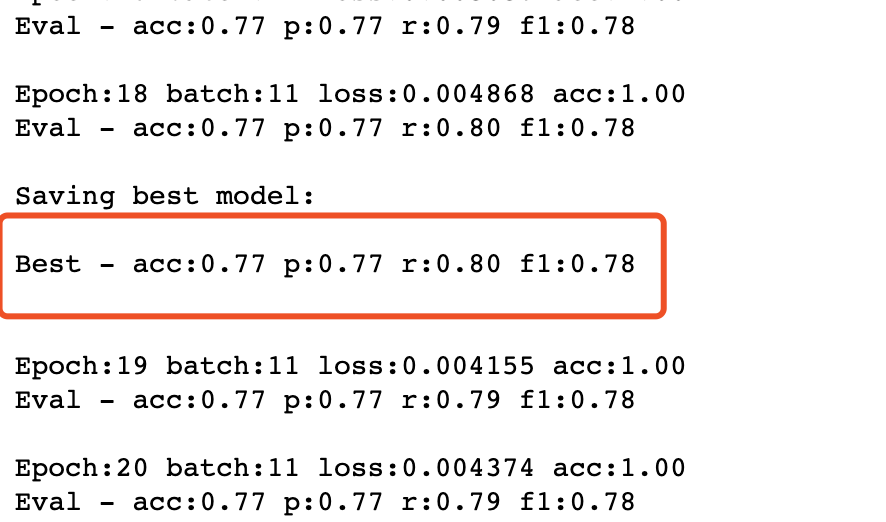

# An End-to-end Deep Learning Workflow for Sentiment Analysis

## Dependencies
**Prefer to run this repo via docker**
- Python >= 3.7
- Docker
- Node.js >= v11.14.0 (For front-end webapp UI)
- npm >= 6.9.0 or yarn >= 1.15.2 (For front-end webapp UI)


## Overview
- [x] **[rubixml](#rubixml)** (A pip library)
  - [x] TextCNN (PyTorch implementation from scratch)
  - [ ] RNN (LSTM/GRU cell)
  - [ ] spaCy (Residual TextCNN)
  - [ ] BERT (Transformer)

- [x] **[base-docker](#base-docker)**
  - [x] Miniconda
  - [x] PyTorch
  - [x] Jupyter Notebook and Lab
  - [x] Docker

- [x] **[trainer](#trainer)** (The main application to train models)
  - [x] Analytics (LDA + Word Cloud)
  - [x] Train model and predict the comments in test.txt
  - [x] Docker

- [x] **[webapi](#webapi)** (Back-end)
  - [x] Flask Server
  - [x] Docker

- [x] **[webapp](#webapp)** (Front-end)
  - [x] React-Redux

- [ ] Pipeline
  - [ ] buildkite or travis-cli


## quick run

- **Clone repo**
 - Run `git clone git@github.com:yinchuandong/sentiment-analysis.git`

- **Start [Flask Server](#webapi)**:
  - `cd ./sentiment-analysis`
  - `./start-webapi`
  - (optinal) request `http://127.0.0.1:5000/api/textcnn/predict`, prefer `postman`

- **Start [Web UI](#webapp)**:
  - (optional) instal yarn (preferred) or npm
  - `cd ./sentiment-analysis/webapp`
  - `yarn install` or `npm install`
  - `yarn start` or `npm start`
  - visit `http://127.0.0.1:3000` in your browser (prefer Chrome)

- **(Optional) Start [Trainer](#trainer)**
  - `cd ./sentiment-analysis`
  - `./start-trainer`
  - visit `http://127.0.0.1:8888` in your browser. You will see a Jupyter notebook page.
  - **type the token** `abcd`
  - **note: if the token is wrong, please shutdown your local jupyter notebook.**


## rubixml
A pip python library that includes machine learning models. The reason of creating this library is to unify the training process and deployment process, which can avoid manually copy scripts. It also can easily manage version controls.

### available models
- **TextCNN**

### run unit test
`cd ./sentiment-analysis/rubixml` & `pytest .`

### installation
Run `cd ./sentiment-analysis/rubixml` & `pip install .`

### usage
```python
# import model
from rubixml.torch_textcnn import TextCNNSentimentClassifier

# initialize model
model = TextCNNSentimentClassifier(embed_dim=50, lr=0.001, dropout=0.5)
model.fit('./example_data/train.txt', nepoch=1)

# predict using the last model weights
last_result = model.predict_prob(sentences)

# reset model with the best model weights
model.use_best_model()

# predict the model using the best model weights
best_result = model.predict_prob(sentences)
```


## base docker
create a basic docker image which contains some necessary libraries, such as jupyter, pytorch, etc.

**Link:** `https://hub.docker.com/r/yinchuandong/miniconda-torch/tags`

**Current Tag:** `v1.0.0`


## trainer
The main application to analyse dataset and train models


### analytics
- **file:** `./trainer/analytics.ipynb`
  - implement word cloud
  - implement LDA

### model training
- **file:** `./trainer/train.ipynb`
  - train TextCNN models using `./trainer/example_data/train.txt`
  - predict scores based on the well-trained model using `./trainer/example_data/test.txt`
  - save the best model to file system for deployment
  


## webapi
A Python Flask Server (uWSGI + nginx) to host the well-trained machine learning models from **[trainer](#trainer)**. It provides public access to models via http requests. (BASE_URL=`http://127.0.0.1:5000/`)

### TextCNN/predict
- **Endpoint**
  ``` HTTP
  POST /api/textcnn/predict
  ```

- **Request**

  | name       | type            | description                    |
  | ---------- | ---------       | ------------------------------ |
  | text       | list of strings | the text to be predicted       |  

- **Response**

  | name       | type            | description                    |
  | ---------- | ---------       | ------------------------------ |
  | score      | list of floats  | the predicted scores between 0 to 1       |
  | status     | string          | indicate whether the request is successful |


- **Example**:


## webapp
A simple web page that allows user to type text on browser and show the prediction results. (BASE_URL=`http://127.0.0.1:3000/`)

