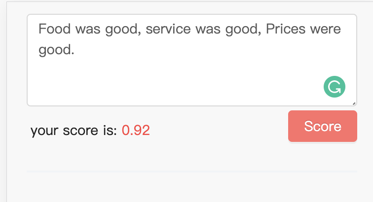

# ML Library

## Dependencies
** Prefer to run this repo via docker **
- Python >= 3.7
- Docker
- Node.js >= v11.14.0 (For front-end webapp UI)
- npm >= 6.9.0 or yarn >= 1.15.2 (For front-end webapp UI)


## Introduction
- [x] rubixml (A pip library)
  - [x] TextCNN (PyTorch implementation from scratch)
  - [ ] RNN (LSTM/GRU cell)
  - [ ] spaCy (Residual TextCNN)
  - [ ] BERT (Transformer)

- [x] base-docker
  - [x] Miniconda
  - [x] PyTorch
  - [x] Jupyter Notebook and Lab
  - [x] Docker

- [x] trainer (The main application to train models)
  - [x] Analytics (LDA + Word Cloud)
  - [x] Train model and predict the comments in test.txt
  - [x] Docker

- [x] webapi (Back-end)
  - [x] Flask Server
  - [x] Docker

- [x] webapp (Front-end)
  - [x] React-Redux

- [ ] Pipeline
  - [ ] buildkite or travis-cli


## quick run

- Start Flask Server:
  - `cd ./sentiment-analysis`
  - `./start-webapi`

- Start UI:
  - (optional) instal yarn (preferred) or npm
  - `cd ./sentiment-analysis/webapp`
  - `yarn install` or `npm install`
  - `yarn start` or `npm start`


## rubixml
A pip python library that includes machine learning models. The reason of creating this library is to unify the training process and deployment process, which can avoid manually copy scripts. It also can easily manage version controls.

### available models
- **TextCNN**

### run unit test
`cd ./sentiment-analysis/rubixml` & `pytest .`

### installation
Run `cd ./sentiment-analysis/rubixml` & `pip install .`


## trainer
The main application to analyse dataset and train models


## webapi
A Python Flask Server (uWSGI + nginx) to host the well-trained machine learning models from **[trainer](#trainer)**. It provides public access to models via http requests.

### TextCNN/predict
- **Endpoint**
  ``` HTTP
  POST /api/textcnn/predict
  ```

- **Request**

| name       | type            | description                    |
| ---------- | ---------       | ------------------------------ |
| text       | list of strings | the text to be predicted       |  

- **Response**

| name       | type            | description                    |
| ---------- | ---------       | ------------------------------ |
| score      | list of floats  | the predicted scores between 0 to 1       |
| status     | string          | indicate whether the request is successful |


- **Example**:


## webapp
A simple web page that allows user to type text on browser and show the prediction results.


